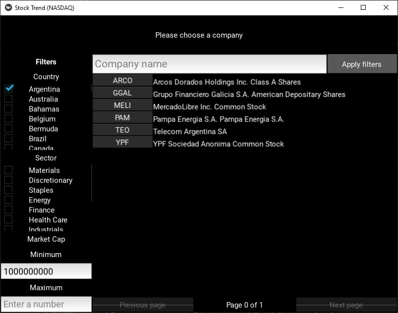
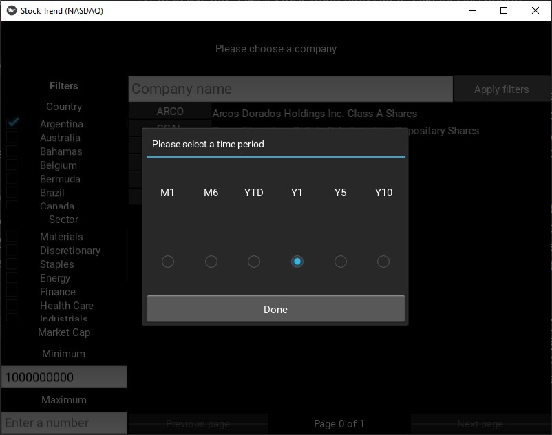
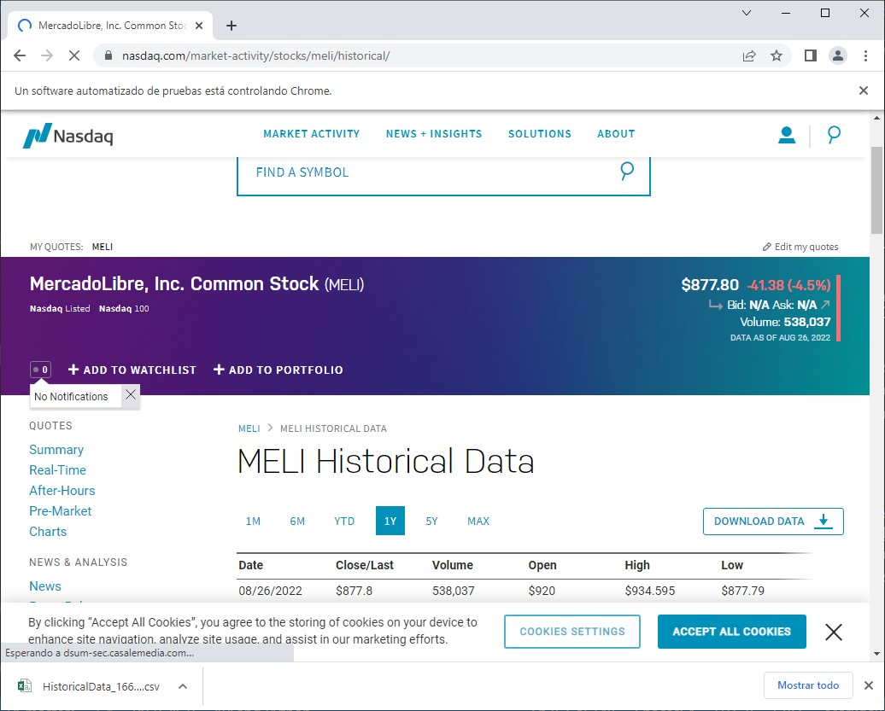
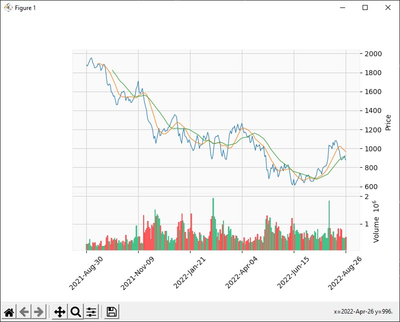

# Stock Trend (NASDAQ)

## Description

1. Through the GUI, which has filters to search, you choose the company you want. If I want Apple, for example, you search for "Apple" and with the filters you can already get its symbol on the NASDAQ index, which is AAPL. You should also be able to search by sector, country and market cap. 
2. Once the company was chosen, you select the time period.
3. After that, the program downloads the company data. 
4. With the data obtained, it shows many tecnical analysis indicators to know if the price will go up or down and show the results. (unfinished)

## How to run the program
Having [Pandas](https://pypi.org/project/pandas/), [Numpy](https://pypi.org/project/numpy/), [mplfinance](https://pypi.org/project/mplfinance/), [Selenium](https://pypi.org/project/selenium/) and [Kivy](https://pypi.org/project/Kivy/) libraries installed (and `Python 3` of course), execute `main.py`. Also, you'll need to have Google Chrome and its driver installed in this directory (you can download the driver [here](https://chromedriver.chromium.org/downloads)).
